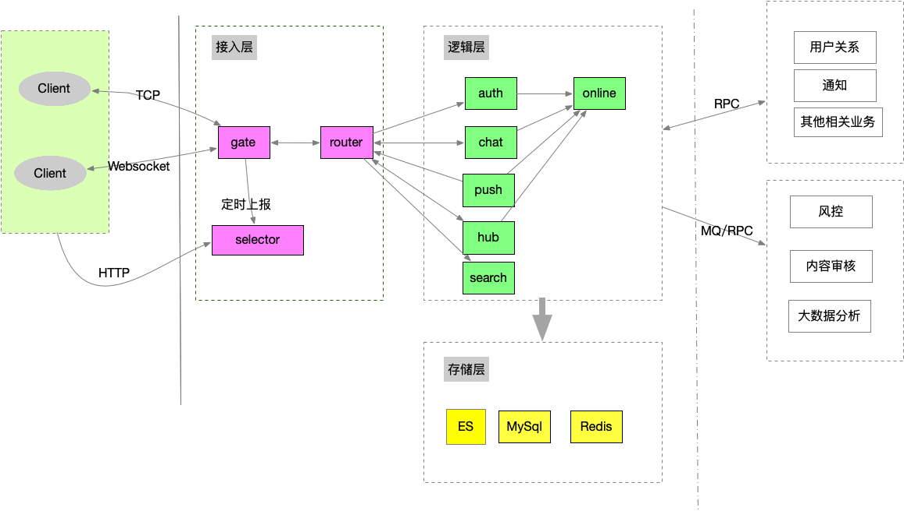

# bubble v1.0

bubble is a im server writen by golang.

## Features
 * 支持Auth
 * 支持tcp，websocket接入
 * 离线消息同步
 * 多业务接入
 * 多设备同时在线
 * 单聊、群聊、超大群
 * 支持水平扩展

## Architecture

以上架构图中，分为几个部分：
* 接入层：主要负责维护与客户端连接相关。
    - gate:网关,暴露给客户端
    - router:路由,将数据包分发到相应的业务
    - selector:为客户端提供合适的gate端点
* 逻辑层：负责IM系统中各逻辑功能的实现。
    - auth:认证
    - chat:聊天(单聊、群聊)
    - push:系统消息推送
    - hub:大群聊天
    - search:聊天记录搜索
    - online:用户在线状态和路由(简单情况下,可考虑直接使用Redis)
* 存储层：消息存储
    - redis:缓存
    - MySQL:持久化
    - ES:为聊天记录提供搜索服务

## 关键设计
 * 协议格式
    - 与客户端交互数据包格式,使用二进制头+ProtocolBuffers
    - 服务之间使用gRpc+ProtocolBuffers
 
 * Auth协议
 
    
    
    RSA解密速度比AES慢,但AES在网络中直使用不安全.采用RSA+AES+ECDH结合方式.RSA用于加密关键数据。ecdh用于客户端与服务端安全协商出对称秘钥（clientEcdh公钥不可直接暴露,存在中间人攻击）
    * 发送方(client)：
    1. 随机生成AES密钥cliRandomEncryKey，并用cliRandomEncryKey加密others(非关键数据)，再用RSA pubKey加密cliRandomEncryKey、token、cliPubEcdhkey. 一齐发送给接收方
   
    * 接收方(server)：
    1. 创建RSA密钥对（pubKey、priKey）pubKey对外公布，priKey自己保存
    2. 用RSA priKey解密客户端发送过来的RSA部分，可以得到cliRandomEncryKey，进而能解密出AES部分内容
    3. 得到cliPubEcdhkey后与服务端的svrPubEcdhkey运算，得到ecdh_share_key
    4. 用ecdh_share_key对sessionKey进行AES，得到encSessionKey
    5. 用cliRandomEncryKey对encSessionKey和svrPubEcdhkey进行AES后，返回给对方
   
    
    
    RSA+cliRandomEncryKey的结合保证了客户端的数据安全送到服务端。cliRandomEncryKey是客户端单方指定，没有和服务端协商。使用RSA+ecdh结合保证ecdh_share_key安全协商处出来。Auth成功后，之后的大部分业务数据使用sessionKey(not cliRandomEncryKey)进行AES加解密。
    

    
 
 * msg存储
    - 单聊和普通群聊使用扩散写,支持消息离线同步
    - 超大群使用读扩散,不支持离线消息同步
    - 最近消息缓存到Redis
    - 双写到MySQL和ES,ES提供聊天记录搜索
 
 * msg协议
 
 * 在线状态服务online

## Dependencies
 * MySQL
 * Redis
 * ES
 * etcd